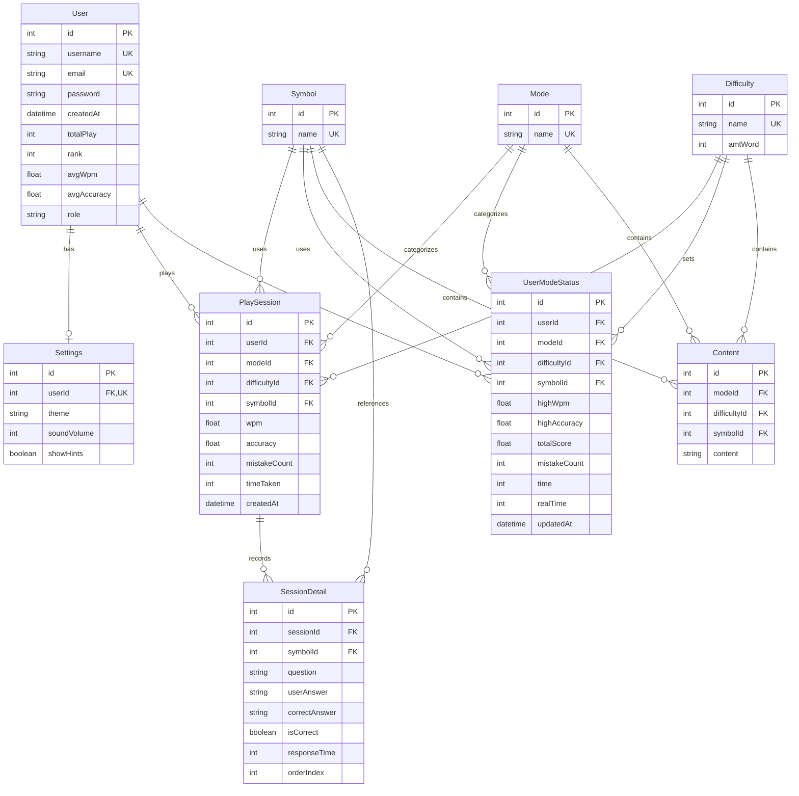

# ER Diagram - MorseCode System

## Entity Relationship Diagram (Mermaid)

## Relationship Summary

| Relationship | Type | Description |
|---|---|---|
| User - Settings | 1:1 | ผู้ใช้แต่ละคนมีการตั้งค่าหนึ่งชุด |
| User - PlaySession | 1:N | ผู้ใช้หนึ่งคนเล่นได้หลาย Session |
| User - UserModeStatus | 1:N | ผู้ใช้หนึ่งคนมีสถิติหลายรายการ (ตาม mode/difficulty/symbol) |
| Mode - PlaySession | 1:N | โหมดหนึ่งมีหลาย Session |
| Mode - UserModeStatus | 1:N | โหมดหนึ่งมีสถิติหลายรายการ |
| Mode - Content | 1:N | โหมดหนึ่งมีเนื้อหาหลายรายการ |
| Symbol - PlaySession | 1:N | สัญลักษณ์หนึ่งถูกใช้ในหลาย Session |
| Symbol - SessionDetail | 1:N | สัญลักษณ์หนึ่งถูกอ้างอิงในหลายรายละเอียด |
| Symbol - UserModeStatus | 1:N | สัญลักษณ์หนึ่งมีสถิติหลายรายการ |
| Symbol - Content | 1:N | สัญลักษณ์หนึ่งมีเนื้อหาหลายรายการ |
| Difficulty - PlaySession | 1:N | ระดับความยากหนึ่งมีหลาย Session |
| Difficulty - UserModeStatus | 1:N | ระดับความยากหนึ่งมีสถิติหลายรายการ |
| Difficulty - Content | 1:N | ระดับความยากหนึ่งมีเนื้อหาหลายรายการ |
| PlaySession - SessionDetail | 1:N | Session หนึ่งมีรายละเอียดหลายข้อ |

## Unique Constraints

- **UserModeStatus**: `(userId, modeId, difficultyId, symbolId)` - สถิติเฉพาะตัวต่อ combination
- **Content**: `(modeId, difficultyId, symbolId)` - เนื้อหาเฉพาะตัวต่อ combination
- **Settings**: `userId` - ผู้ใช้หนึ่งคนมีแค่หนึ่งการตั้งค่า

## Cascade Delete Rules

- `User` ถูกลบ → `Settings`, `PlaySession`, `UserModeStatus` ถูกลบตาม
- `PlaySession` ถูกลบ → `SessionDetail` ถูกลบตาม
